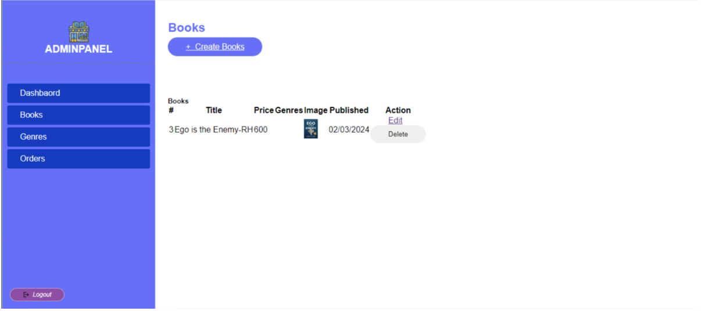

# E-store Project Output

## Overview
The E-store project is an e-commerce platform designed to facilitate the purchase of books online, providing customers with a seamless and secure shopping experience.

## Features of the Project
- **User Registration and Login:** Allows users to create an account and access the platform's functionalities.
- **Product Browsing and Search:** Users can browse and filter books by category, price, etc.
- **Shopping Cart and Checkout:** Add books to the cart, review orders, and proceed with checkout.
- **Payment Processing:** Integrated with multiple payment options, such as Khalti and cash on delivery.
- **Admin Features:** Admins can manage books and categories, including adding, editing, and deleting books.
- **Responsive Design:** Optimized for use on desktop, tablets, and mobile devices.

## System Architecture
The E-store project follows a three-tier architecture:
1. **Presentation Layer:** User-facing interface built for seamless navigation.
2. **Application Layer:** Handles business logic and data processing.
3. **Data Layer:** Uses MongoDB for data storage.

## Screenshots
### 1. Homepage

### 2. Login/Homepage Listing

### 3. Product Listing

### 4. Genre Listing

### 5. Add Book Listing

### 6. Checkout Page

## Project Objectives
- Provide customers with a wide range of book options at competitive prices.
- Offer a user-friendly, secure platform for online book purchases.

## Implementation Details
- **Frontend:** Laravel framework with responsive UI.
- **Backend:** PHP-based server-side logic.
- **Database:** MYSQL for storing book and user data.
- **Payment Integration:** Khalti and eSewa for secure transactions.

## Testing and Validation
All core functionalities, such as user registration, login, product browsing, checkout, and admin operations, were tested to ensure smooth user interactions and system stability.

## Future Enhancements
- **Product Recommendations:** Suggest books based on search trends.
- **Enhanced Search and Filtering Options.**
- **Improved Payment System Integration.**

## Lessons Learned
Building the E-store project provided valuable insights into e-commerce development, Laravel integration, and online payment gateways.